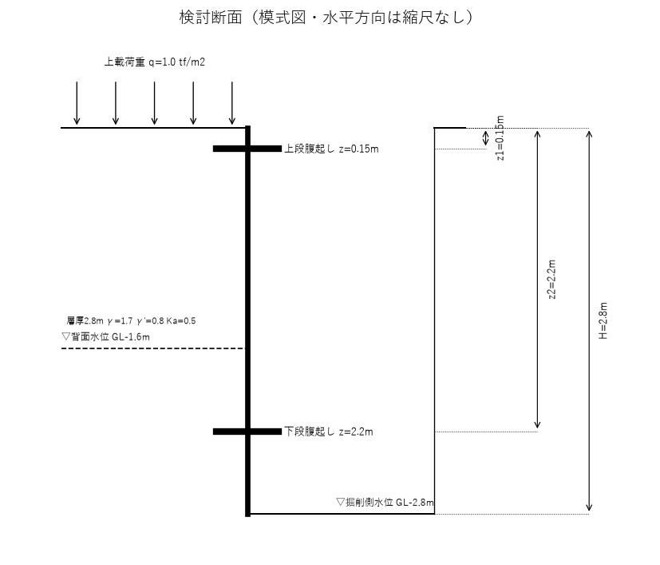
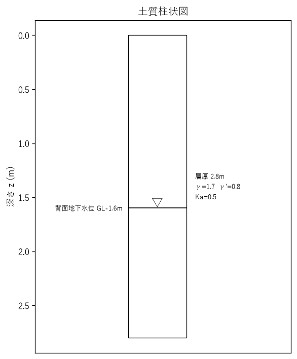
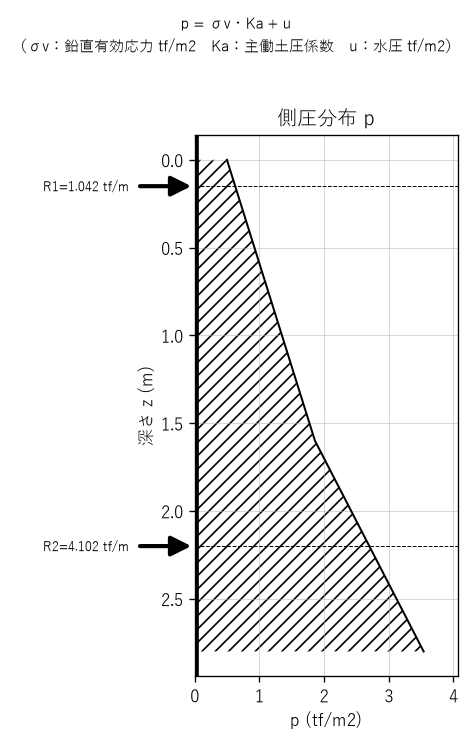
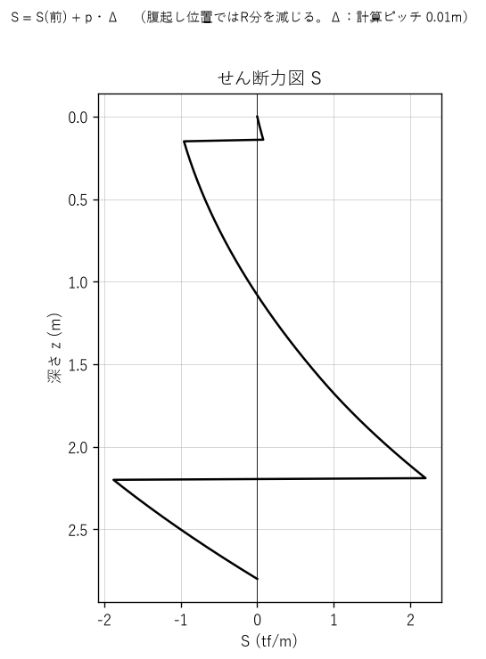
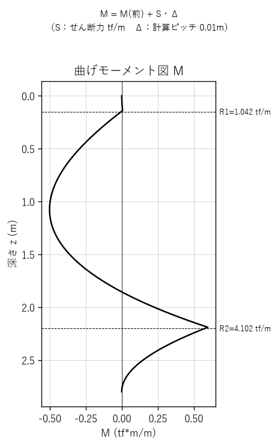

# 簡易土留 安定計算書 — サンプル現場

## 設計条件

| 項目 | 値 |
|---|---|
| 掘削深 H | 2.8 m |
| 上段腹起し z1 | 0.15 m |
| 下段腹起し z2 | 2.2 m |
| 許容曲げ応力度 σa | 1800.0 kgf/cm2 |

## 検討断面

## 土質柱状図

## 反力

| 項目 | 値 |
|---|---|
| 上段腹起し反力 R1 | 1.042 tf/m |
| 下段腹起し反力 R2 | 4.102 tf/m |

## 最大曲げモーメントと必要断面係数

| 項目 | 値 |
|---|---|
| 最大曲げモーメント Mmax | 0.597 tf*m/m（z=2.19m） |
| 必要断面係数 Z_req | 33.2 cm3/m |

⚠ 必要断面係数 Z_req=33.2 cm3/m を満たす規格がyaita_spec.json 内に見つかりません。

## 側圧分布図

## せん断力図（S図）

## 曲げモーメント図（M図）

