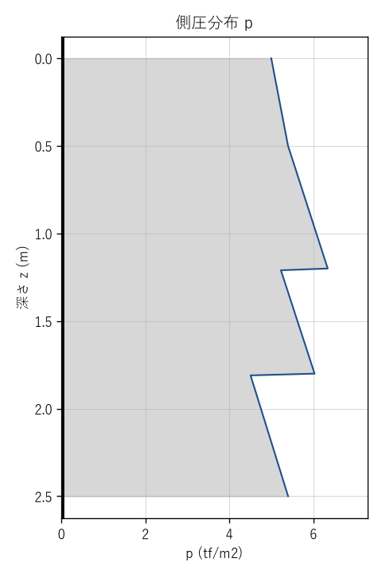
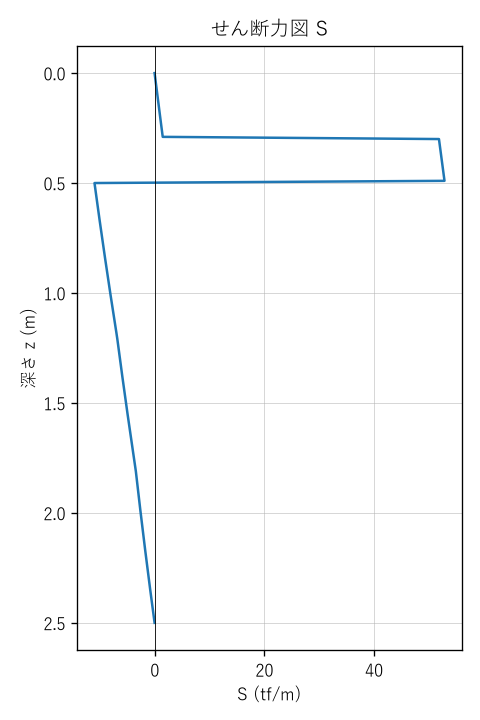
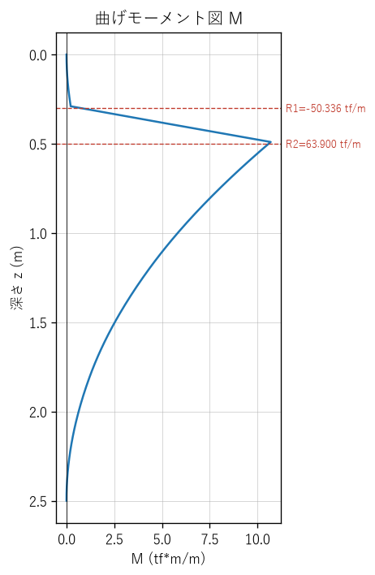

# 簡易土留 安定計算書 — 001

## 設計条件

| 項目 | 値 |
|---|---|
| 掘削深 H | 2.5 m |
| 上段腹起し z1 | 0.3 m |
| 下段腹起し z2 | 0.5 m |
| 許容曲げ応力度 σa | 1800.0 kgf/cm2 |

## 反力

| 項目 | 値 |
|---|---|
| 上段腹起し反力 R1 | -50.336 tf/m |
| 下段腹起し反力 R2 | 63.900 tf/m |

## 最大曲げモーメントと必要断面係数

| 項目 | 値 |
|---|---|
| 最大曲げモーメント Mmax | 10.696 tf*m/m（z=0.49m） |
| 必要断面係数 Z_req | 594.2 cm3/m |

⚠ 必要断面係数 Z_req=594.2 cm3/m を満たす規格がyaita_spec.json 内に見つかりません。

## 側圧分布図

## せん断力図（S図）

## 曲げモーメント図（M図）

